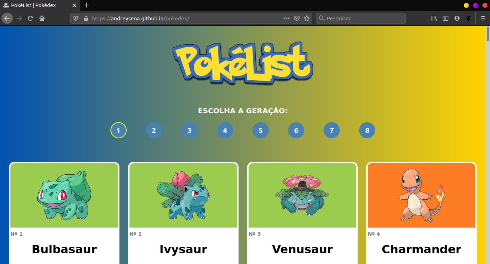
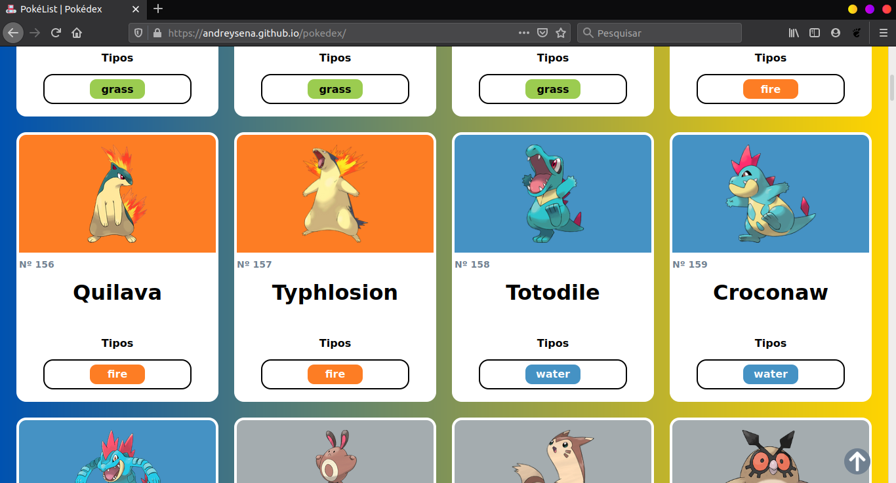
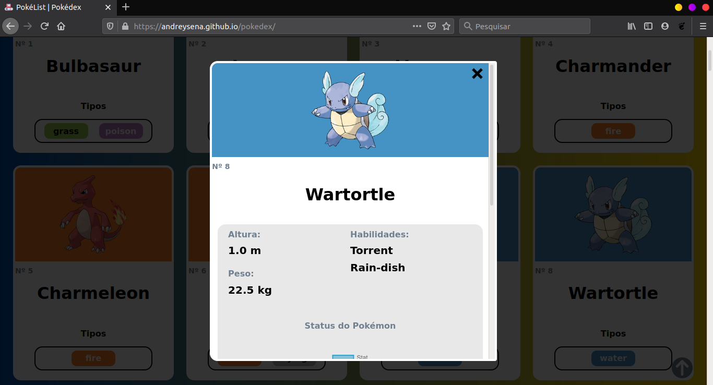

<h1 align="center">Pokélist | Pokédex</h1>

 

## Tecnologia utilizada

 

## Descrição do projeto
O projeto consiste em uma Aplicação Web que exibe uma lista de Pokémon por geração e os detalhes de cada um deles.  
A aplicação consume a [PokéAPI](https://pokeapi.co/) para obter as informações necessárias sobre os Pokémon.

 

## Imagens do projeto

> ### Lista de Pokémon

> ### Destalhes do Pokémon  

---

 

## Site
Clique no link a seguir para acessar a aplicação: [Pokédex](https://andreysena.github.io/pokedex/)

 

---

## Licença

Esse projeto está sob a licença MIT. Veja o arquivo [LICENSE](LICENSE.md) para mais detalhes.